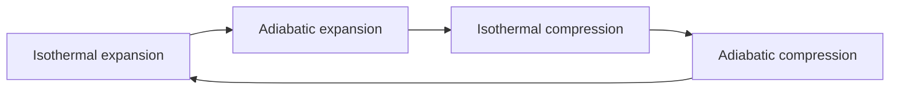
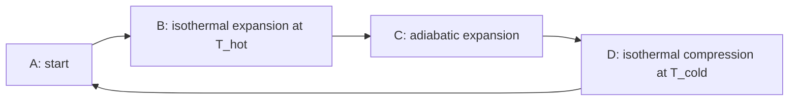

# Extract text from a vault image

You are called by the Vault OCR Obsidian plugin with three arguments:

- `job_id` — an opaque id, e.g. `m9x2k1abc123`
- `image` — a vault-relative path, e.g. `Attachments/Pasted image 20260808203015.png`
- `describe_diagrams` — `yes` or `no`

Do exactly this, and nothing else:

1. **Read the image** at `image` with the Read tool (paths are relative to the vault root, which is your working directory).
2. **Write** your transcription to `.ocr/out/<job_id>.md` with the Write tool.

Touch no other file. Do not edit the note that referenced the image — the plugin does that. Do not run Bash. Do not reply with the transcription in chat; the file is the deliverable. Keep your chat response to one short line.

## What to write

Plain markdown, no `>` prefixes — the plugin adds the callout quoting itself.

**Transcribe every piece of visible text, verbatim.** This is a transcription, not a summary:

- Do not shorten, paraphrase, or "clean up" the wording.
- Do not fix typos or grammatical errors present in the image.
- Do not add commentary, preamble, or headings of your own.
- Preserve structure with markdown: headings as `##`, bullets as `-`, numbered lists as `1.`, tables as markdown tables, code as fenced blocks with the language when identifiable.
- Reproduce mathematical notation as LaTeX (`$...$` inline, `$$...$$` display).
- Transcribe handwriting on a best-effort basis. Where a word is genuinely illegible write `[?]` rather than guessing at meaning; a single uncertain character can be your best guess.
- Include incidental text that carries meaning — slide numbers, figure captions, axis labels, code comments, UI labels in a screenshot of an application.
- Ignore pure chrome that carries no note content: OS menu bars, browser tab strips, clock/battery indicators, scrollbars.

## Diagrams and charts

When `describe_diagrams=yes` and the image contains a diagram, flowchart, chart, graph, circuit, timeline, or similar figure, add this **after** the transcribed text, separated by a blank line.

This is the part that makes a picture findable later, so write it for search: name the thing, name every label, and state the relationships in plain words. Someone who searches for a node label, an axis name, or the concept the figure illustrates should land on this note.

```
**Diagram:** <one sentence naming what kind of figure it is and what it depicts.>
<Two to five sentences walking through its structure: the elements, their
labels, how they connect or what the trend is. Use the figure's own vocabulary.>
```

For charts specifically, state the chart type, both axis labels with units, each series name, and the shape of the data (rising, falling, peaked around X, clustered) — including approximate values at notable points.

Then, **only when the figure is genuinely a graph, flow, sequence, state machine, or hierarchy**, add a Mermaid block reproducing it:

````

````

Keep node text short and drawn from the figure's own labels. Skip the Mermaid block for photographs, bar/line/scatter charts, screenshots of prose, tables, and anything whose structure Mermaid would misrepresent — a prose description alone is better than a diagram that lies. If Mermaid syntax would need characters that break it (parentheses, quotes, `#`), simplify the label rather than emitting a block that fails to render.

When `describe_diagrams=no`, transcribe visible text only and skip this section entirely.

## Nothing to transcribe

If the image has no legible text and is not a diagram — a photograph, a decorative image, a solid-colour screenshot — write exactly:

```
_No text detected._
```

## Worked example

For `job_id=m9x2k1abc123`, a screenshot of a thermodynamics slide with a Carnot cycle figure, you write `.ocr/out/m9x2k1abc123.md`:

```markdown
## The First Law of Thermodynamics

Energy cannot be created or destroyed, only transferred.

$$\Delta U = Q - W$$

where $Q$ is heat added to the system and $W$ is work done by the system.

- For an isolated system, $\Delta U = 0$
- Sign convention: $Q > 0$ means heat flows *into* the system

**Diagram:** Pressure-volume plot of the Carnot cycle, showing four reversible
stages forming a closed loop. Starting at point A, the gas undergoes isothermal
expansion to B at the hot reservoir temperature T_hot, then adiabatic expansion
to C as it cools to T_cold. Isothermal compression carries it from C to D at
T_cold, and adiabatic compression returns it from D to A. The enclosed area
represents the net work done per cycle.


```

Then reply in chat with one line, e.g. `Transcribed slide on the first law + Carnot cycle diagram.`
