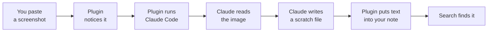
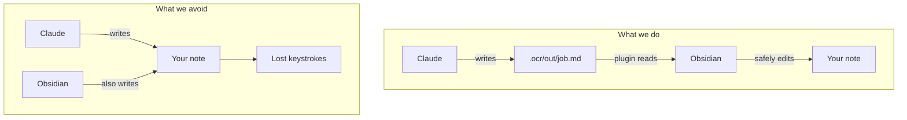

# Architecture — how the screenshot search actually works

Written to be read start to finish with no plugin-development background. Open
it inside Obsidian so the diagrams render.

---

## 1. The problem, precisely

Obsidian's search reads **text in your `.md` files**. Nothing else. When you
paste a screenshot, the note gets a single line like:

```markdown
![[Attachments/Pasted image 20260808203015.png]]
```

That line is all search can see. The words *in* the picture are pixels in a
separate `.png` file, and no amount of searching will surface them. A semester
of screenshot notes is, to Obsidian, a semester of near-empty files.

**The fix is unglamorous:** put the words from the picture into the `.md` file
as ordinary text. Everything below is machinery for doing that automatically,
and for keeping the result out of your way while you read.

---

## 2. The shape of the solution

Three pieces, each doing one job:

| Piece | Lives in | Job |
| --- | --- | --- |
| **The plugin** | `.obsidian/plugins/vault-ocr/` | Notices pasted images, edits your notes, manages the queue |
| **The skill** | `.claude/skills/ocr-extract/` | Instructions telling Claude how to transcribe one image |
| **Claude Code** | already installed on your PC | Actually looks at the image and reads it |

The plugin **cannot see images** — it's just code, it has no eyes. Claude Code
can. So the plugin's real job is to be a good manager: spot the work, hand it
off, and file the result in the right place.



---

## 3. Walking through one paste, step by step

### Step 1 — You paste

You hit `Ctrl+V` in a note. **Obsidian handles this itself**, exactly as it
always has: it saves the image into your attachments folder using your naming
settings and inserts the `![[...]]` line.

The plugin deliberately does *not* interfere here. Intercepting the paste would
mean reimplementing Obsidian's attachment logic, and getting it subtly wrong for
anyone with non-default settings. Instead the plugin just watches.

### Step 2 — The plugin spots the new image

The plugin listens for a "paste happened" event. When one fires and the
clipboard contained an image, it waits a moment, re-reads the note, and compares
the images in it against the ones that were there a second ago.

Whatever is new is what you just pasted. This *diffing* approach means the
plugin never has to guess the filename Obsidian chose — it just observes the
result.

> Code: `src/main.ts`, the `scheduleScan` method.

### Step 3 — The plugin writes a placeholder

It edits your note to add a marker directly under the image:

```markdown
![[Attachments/zeeman.png]]

> [!ocr]- Extracting text… <!--ocr:job:m9x2k1abc:Attachments/zeeman.png-->
```

Two things are going on in that line:

- `> [!ocr]-` is an Obsidian **callout** — a boxed section. The trailing `-`
  means "start folded", so it shows as one collapsed line rather than a wall of
  text. Click the arrow to open it.
- `<!--ocr:job:...-->` is an **HTML comment**. Obsidian never displays it, but
  the plugin can find it again later. It carries a random job id and the image's
  path.

That comment is the single most important detail in the whole design. It's how
the plugin, minutes later and possibly after a restart, knows *which* image a
given callout belongs to and *where* to put the incoming text. A callout with no
comment is finished; a callout with one is still owed an answer.

> Code: `src/placeholder.ts` — everything about building, finding, and replacing
> these blocks lives in that one file.

### Step 4 — The plugin launches Claude Code

The plugin runs this on your machine, invisibly:

```
claude -p "/ocr-extract job_id=m9x2k1abc image=Attachments/zeeman.png describe_diagrams=yes"
       --model sonnet
       --permission-mode acceptEdits
       --allowedTools Read Write
```

Reading it flag by flag:

- **`-p`** — "print mode". Run one task, print the answer, exit. No chat window,
  no interaction. Sometimes called *headless*.
- **`/ocr-extract ...`** — invokes the skill (section 4) with three arguments.
- **`--model sonnet`** — which Claude model. Sonnet is fast and plenty accurate
  for screenshots; Opus is available in settings for hard handwriting.
- **`--permission-mode acceptEdits`** — don't stop to ask "may I write this
  file?". There's no human watching this session, so a permission prompt would
  simply hang forever.
- **`--allowedTools Read Write`** — and this is the safety belt: the session is
  allowed to read files and write files, and *nothing else*. No running
  commands, no deleting, no network.

Because it's the `claude` command you already have installed and logged into,
this runs on **your existing subscription**. There is no API key anywhere in
this vault, and the plugin never contacts Anthropic directly.

> Code: `src/runner.ts`.

### Step 5 — Claude reads the image and writes a scratch file

Claude opens the image, transcribes it, and saves the result to:

```
.ocr/out/m9x2k1abc.md
```

Note the filename: it's the job id. That's how the plugin will match the answer
back to the question.

**Claude does not touch your note.** This is a deliberate rule, and section 6
explains why it matters more than it looks.

### Step 6 — The plugin files the result

The plugin sees Claude exit successfully, reads the scratch file, and swaps it
into your note — replacing the placeholder callout, comment and all:

```markdown
![[Attachments/zeeman.png]]

> [!ocr]- Extracted text
> ## Lecture 7: Zeeman Effect
> The splitting of spectral lines in a magnetic field.
> ...
```

Every line gets a `> ` prefix so it sits inside the callout. The job comment is
gone, which is precisely what marks this image as done — the plugin will never
pick it up again.

Then it deletes the scratch file. Done.

The text is now plain markdown in your `.md`, which is the entire point:
`Ctrl+Shift+F` finds it.

---

## 4. The skill: instructions, not code

`.claude/skills/ocr-extract/SKILL.md` is a **plain English document**. There's
no programming in it. It's what Claude reads to learn what you want, and you can
edit it in Obsidian like any other note.

It says, roughly:

1. Read the image at this path.
2. Transcribe **every** word exactly — don't summarise, don't fix typos, don't
   add commentary. Keep headings as headings, lists as lists, maths as LaTeX.
3. If it's a diagram or chart, *also* describe it in prose and, when the shape
   allows, redraw it as a Mermaid diagram.
4. Write the result to `.ocr/out/<job_id>.md`. Touch nothing else.

**Want different behaviour? Edit that file.** It's the tuning knob for output
quality, and no rebuild is needed — the next extraction picks up the change
immediately. Some things you might do:

- Add "Translate any German text to English underneath the original."
- Add "Prefix every transcription with the slide number if one is visible."
- Loosen the verbatim rule if you'd rather have summaries than transcriptions.

### Why diagrams get special treatment

A flowchart contains almost no searchable text — a few node labels floating in
white space. Transcribing those labels alone would give you a note that mentions
`Client SYN` and nothing about what the figure *means*.

So for figures, the skill asks for a written description naming every element
and how they connect. That paragraph is what turns "a picture of the TCP
handshake" into something you'll actually find in three months when you search
`three-way handshake`. The Mermaid block on top is a bonus: a real, rendered
diagram you can read without opening the screenshot.

---

## 5. The plugin's files

All under `.obsidian/plugins/vault-ocr/`.

| File | What it handles |
| --- | --- |
| `src/main.ts` | The conductor. Registers commands, watches for pastes, edits notes. Start reading here. |
| `src/placeholder.ts` | All the text-surgery: find images in a note, insert placeholders, splice results in. Pure text in, text out — which is why it's the easiest part to test. |
| `src/runner.ts` | Finds and launches the `claude` program. Handles timeouts and failures. |
| `src/queue.ts` | The waiting line (section 7). |
| `src/sidecar.ts` | Reads and cleans up the `.ocr/out/` scratch files. |
| `src/settings.ts` | The settings screen. |
| `styles.css` | Makes the `[!ocr]` callout look distinct and slightly recessed. |
| `manifest.json` | Tells Obsidian the plugin's name and that it's desktop-only. |
| `main.js` | **Generated.** The above, compiled into one file. This is what Obsidian actually loads. |

### Why there's a build step

Obsidian runs JavaScript. The plugin is written in **TypeScript** — the same
language plus type checking, which catches a whole category of mistakes before
the code ever runs. `npm run build` converts `src/*.ts` into the single
`main.js` that Obsidian loads.

**So: if you edit anything in `src/`, you must rebuild.** In a terminal:

```
cd .obsidian/plugins/vault-ocr
npm run build
```

Then reload Obsidian (`Ctrl+R`). Editing `src/` without rebuilding changes
nothing — a confusing five minutes if you don't know about this step.

Editing `SKILL.md` needs **no** rebuild. It isn't code.

---

## 6. The one design decision worth understanding

Claude Code is perfectly capable of editing your note directly. It would be
fewer moving parts: no scratch files, no job ids, no matching answers to
questions. So why the detour?

**Because two programs writing the same file at the same time corrupts it.**

Picture it: the screenshot is pasted, extraction starts, and you keep typing —
that's the whole point, you're mid-lecture. Fifteen seconds later Claude writes
its transcription straight into the `.md` on disk. Obsidian notices the file
changed underneath it and reloads the note. Everything you typed in those
fifteen seconds is gone, and undo can't get it back, because as far as Obsidian
is concerned the file simply changed.

The scratch-file hop makes that impossible. Claude writes only to
`.ocr/out/`, a folder you never open. The plugin reads it and applies the change
through Obsidian's own editing API — the same path a normal edit takes, so
Obsidian stays in charge of the file, your typing is safe, and undo works.

It costs one extra file per image, deleted seconds later. Cheap insurance
against silently losing your notes.



---

## 7. The queue, and why it exists

Paste twenty lecture slides at once and, without a queue, the plugin would
launch twenty simultaneous Claude sessions. Your laptop would crawl and you'd
burn a chunk of your quota in one keystroke.

So jobs go into a **waiting line** and run two at a time (adjustable in
settings). The status bar shows `OCR 2/17` — two running, seventeen total.

The queue also handles the boring realities:

- **One retry.** If a session fails, it tries once more. Transient hiccups are
  common; infinite retry loops are not helpful.
- **Cancellation.** *Cancel all running extractions* stops everything.
- **Failures are visible, never silent.** A failed job rewrites its callout to
  `⚠ Extraction failed — <reason>` and keeps the job comment, so *Retry failed
  extractions* can find it later. Nothing disappears quietly.

> Code: `src/queue.ts`.

---

## 8. Reference: what each marker means

When you're reading raw markdown and wondering what state something is in:

| What you see | State |
| --- | --- |
| `![[image.png]]` with no callout under it | Never processed. *Extract all images in this note* will pick it up. |
| `> [!ocr]- Extracting text… <!--ocr:job:...-->` | Queued or running right now. |
| `> [!ocr]- ⚠ Extraction failed — ... <!--ocr:job:...-->` | Failed. The reason is on the line; retry after fixing it. |
| `> [!ocr]- Extracted text` (no comment) | **Done.** Never touched again. |

The rule underneath: **a job comment means unfinished business.** Don't delete
those comments by hand, or the plugin loses track of what it owes you.

---

## 9. Things you might want to change

| Goal | Where |
| --- | --- |
| Different transcription style, extra rules, translation | `.claude/skills/ocr-extract/SKILL.md` — plain English, no rebuild |
| Better accuracy on handwriting | Settings → Model → Opus |
| Stop auto-extracting during a fast lecture | Settings → toggle off, batch it later |
| Faster backfilling of old notes | Settings → Max concurrent (costs more quota) |
| Change the callout's appearance | `styles.css` |
| Change the callout label wording | Settings → Callout label |
| Change the plugin's behaviour | `src/*.ts`, then **rebuild** |

---

## 10. When something's wrong

**Nothing happens when I paste.** Check the plugin is enabled: Settings →
Community plugins. Then Settings → Vault OCR → confirm the Claude Code binary
path resolves.

**Every image fails immediately.** Almost always Claude Code isn't logged in.
Open a terminal, run `claude`, sign in, try again.

**Callouts stay on "Extracting text…" forever.** The plugin was probably
restarted mid-job. Run *Extract text for all images in this note* — it picks up
orphaned placeholders as well as new images.

**I edited `src/` and nothing changed.** You skipped the rebuild. See section 5.

**Extraction is slow.** ~13 seconds per image is normal — Claude is genuinely
reading the picture. It runs in the background; keep typing.
